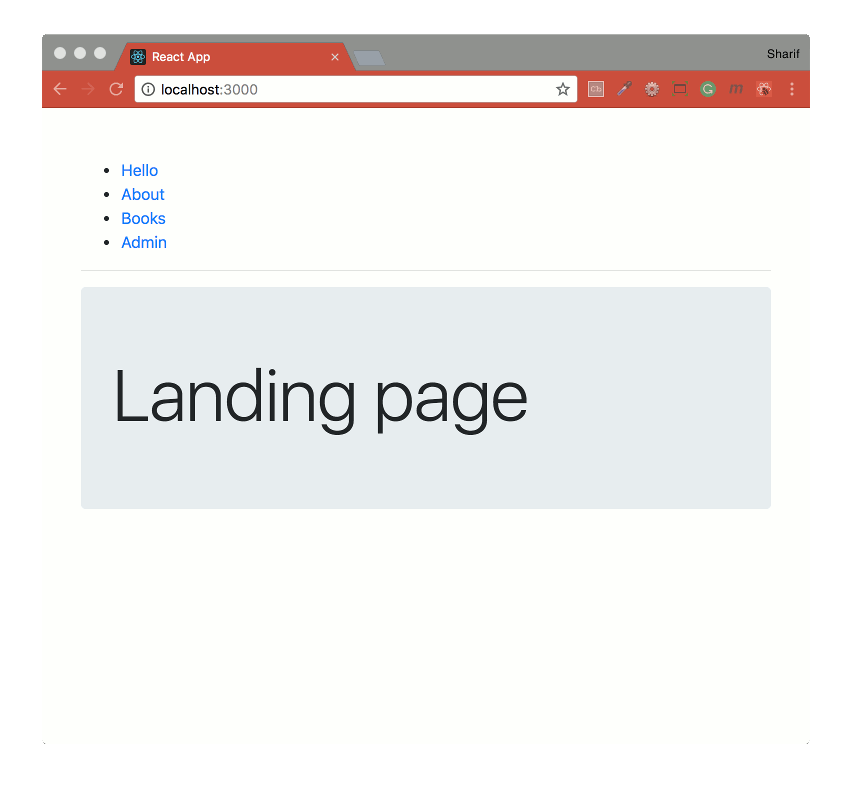

## React Router Demos
Exercises carried out from the following article; [Beginner’s Guide to React Router 4](https://medium.freecodecamp.org/beginners-guide-to-react-router-4-8959ceb3ad58), credit due to [Emmanuel Yusufu](https://github.com/emmyyusufu).



This article is divided into four subsections:
- [Basic routing](#basic-routing)
- [Nested routing](#nested-routing)
- [Nested routing with path parameters](#nested-routing-with-path-parameters)
- [Authenticated routing](#authenticated-routing)

This project was bootstrapped with [Create React App](https://github.com/facebookincubator/create-react-app).

#### Built with
* [npm](https://www.npmjs.com/) - Node Package Manager.
* [create-react-app](https://github.com/facebook/create-react-app) - Create React apps with no build configuration.
* [react-router-dom](https://www.npmjs.com/package/react-router-dom) - DOM bindings for React Router.

#### Installation
To run this project you will need to download it onto your local machine and install all dependencies.
Navigate inside the folder and install all dependencies by entering the following command on your terminal window:
```
npm install
```
Finally to run the server enter the following command in your terminal window:
```
npm start
```
This will run the server, open [http://localhost:3000](http://localhost:3000) to view it in the browser. If you make any changes and save the changes process will automatically refresh and you will be able to see the results in the browser.

If you want to end the process hold `control` and press `c` in mac, if you are not using mac hold `ctrl` and press `c`.

#### Basic routing
The `<Route />` component; this component renders a page if the current URL location matches the path prop specified in it. It also accepts component, render and children props.

The `<Link></Link>` component; this is replaces the default `<a href=""></a>` HTML tag. It accepts a `to=""` prop that points to the URL location we want to go to.

The `<Switch></Switch>` component; this will require being wrapped around Route components when needed for implementation. When a URL path is visited, it allows only the first `<Route>` that matches the path to be rendered.

#### Nested routing
The component that will be created via Route will automatically be passed the following `prop` objects:
- match
- location
- history

We will use of match as it is helpful for implementing nested routes. The match object contains the following properties:
- <b>params</b> (object): Key/value pairs parsed from the URL corresponding to the dynamic segments of the path
- <b>isExact</b> (boolean): true if the entire URL was matched (no trailing characters)
- <b>path</b> (string): The path pattern used to match. Useful for building nested `<Route>`
- <b>url</b> (string): The matched portion of the URL. Useful for building nested `<Link>`

#### Nested routing with path parameters
Any URL that ends with `/:id`, `/:user`, or `/:whatever` indicates that that portion is a dynamically generated part of the URL that could be any value. We can access such portions via `match.params.id` for use in routing.

#### Authenticated routing
To handle protected paths, we’ll need to use `<Redirect/>` (a standard component) and `<PrivateRoute/>` (a custom component). Custom routes are necessary when we need to make a decision whether a `<Route/>` of interest should be rendered or not.

The `<Redirect/>` component; rendering a `<Redirect>` will navigate to a new location. The new location will override the current location in the history stack, like server-side redirects HTTP.

`<Redirect/>` has a couple of props but we will be using the to object prop this way:
```js
<Redirect to={{
  pathname: '/login',
  state: { from: props.location }
}}/>
```
When used, this will redirect to the `/login` path. Information about the last location before the redirect was done will be accessible by the LoginPage component via `this.props.location.state`.